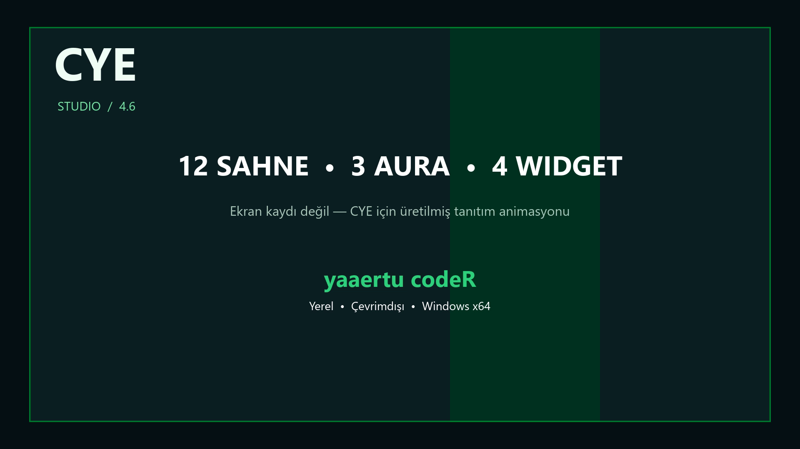

# CYE Studio 4.6.0

Geliştirici: **yaaertu codeR**

CYE Studio, Windows x64 için yerel ve çevrimdışı çalışan masaüstü efekt uygulamasıdır. Sistem rengini kullanan uygulamalarda seçim rengini değiştirir; masaüstü seçim ışığı, imleç parıltısı, görev çubuğu sahneleri ve Dosya Gezgini arka aurası ekler.

[Türkçe tanıtım videosunu izle](media/cye-turkce-tanitim.mp4)



## Özellikler

- RGB seçim rengi, hazır renkler ve hassas kanal ayarları
- Birbirinden farklı 12 görev çubuğu sahnesi; Matrix Rain ve Quantum Glitch dahil
- Orbit Frame, Prism Halo ve Ember Orbit klasör auraları
- Clock Halo, Audio Pulse, CYE Status ve Cyber Terminal widgetları; sağ tık menüsü dahil
- Emerald Glass, Midnight Mac, Cyber Matrix, Titanium ve Sunset Graphite arayüz temaları
- Parlaklık, hareket hızı ve detay yoğunluğu kontrolleri
- Yerel Windows ses seviyesine tepki, sistem tepsisi ve sürekli açık çalışma
- Gömülü logo, uygulama simgesi ve **yaaertu codeR** imzası

## Kurulum

1. Releases bölümünden `CYE Studio.exe` dosyasını indir.
2. Windows x64 bilgisayarda çalıştır.
3. Pencereyi X ile kapatırsan uygulama sistem tepsisinde açık kalır.
4. Tam çıkış ve Windows renklerini geri yüklemek için uygulamadaki **Kapat ve geri yükle** düğmesini kullan.

EXE kendi çalışma ortamını içerir; ayrıca .NET kurulumu gerekmez.

## Bilinen sınırlar ve gizlilik

Kendi temasını çizen bazı uygulamalar Windows sistem seçim rengini kullanmayabilir. CYE desteklenen alanlarda Windows API'lerini, masaüstü ve görev çubuğunda tıklamayı engellemeyen saydam katmanları kullanır. Görselleştirici yalnızca yerel çıkış ses seviyesini okur; ses kaydetmez, saklamaz veya yüklemez.

Halka açık pakette kaynak kod bulunmaz. Kaynak yalnızca proje sahibinde kalır.

## Doğrulama

Bu sürümün kendi kendine testi 7/7 geçti. RGB uygulama/geri yükleme, çökme kurtarması ve geçersiz kurtarma verisinin reddi doğrulandı.

`CYE Studio.exe` SHA256:

```text
07CDC52664929C26049005AFAFDA39A545AF9CB22654A9F0D0D9B1BCA753900B
```

Telif hakkı © 2026 yaaertu codeR. Tüm hakları saklıdır.
